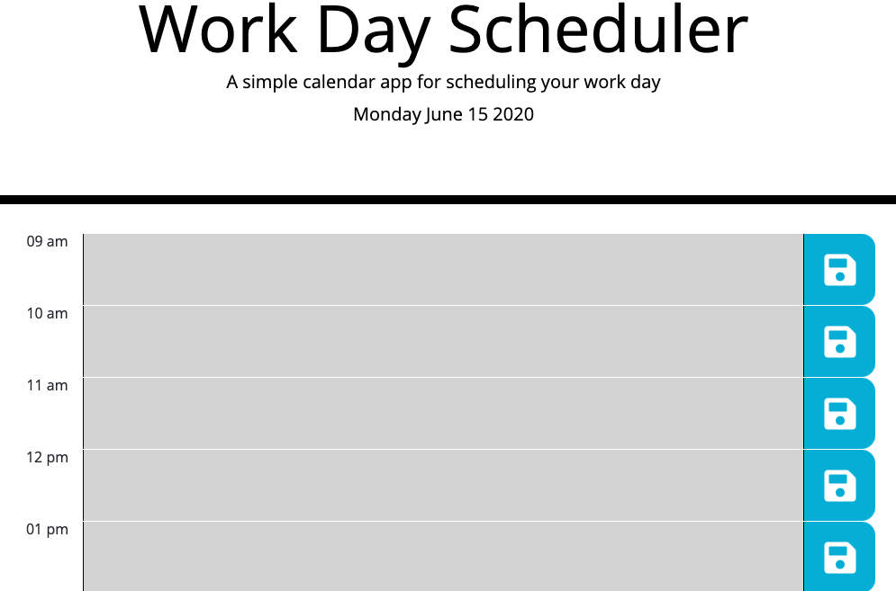

# Daily-Planner

Plan your work day in a snap!

___

## Description

The daily planner is a helpful tool that will allow the user to write, save, and view his/her plans for the work day.  The main body changes colors depending on the time of day. It is an interactive display that highlights the days events.
___

## How It Works

The daily planner is arranged with rows and columns that the provide the user with a number of options to chose from. In the main body of the planner, the hour corresponding to the current time is displayed.  As the time changes, the hour rows change colors to keep the user aware of their current tasks for that hour, the past tasks that have already happened in that day, and what is to come until end of the work day.

The user can interact with the planner by adding in tasks at the needed time, then clicking the save button on the right side of the screen.  By doing this, the users tasks get saved into local storage where they will stay until the user deletes the task.

The functionality of the planner is based around the usage of Moment JS that is used to not only indicate the hour of the day, but to also set the date in the header of the page. Below is a visual representation of the daily planner. During the hours of 9 AM - 5 PM, the calendar displays red for the current hour and green for anytime in the future. For this example, the blocks are grey to show that the work has ended.

___

## Link to Project

https://ccraig7321.github.io/Daily-Planner/

___

## Technologies

- HTML
- CSS
- Moment JS
- Bootstrap
- Bootswatch
- Javascript
- Visual Studio Code

___

### License

Copyright 2020 CHELSEY CRAIG

Permission is hereby granted, free of charge, to any person obtaining a copy of this software and associated documentation files (the "Software"), to deal in the Software without restriction, including without limitation the rights to use, copy, modify, merge, publish, distribute, sublicense, and/or sell copies of the Software, and to permit persons to whom the Software is furnished to do so, subject to the following conditions:

The above copyright notice and this permission notice shall be included in all copies or substantial portions of the Software.

THE SOFTWARE IS PROVIDED "AS IS", WITHOUT WARRANTY OF ANY KIND, EXPRESS OR IMPLIED, INCLUDING BUT NOT LIMITED TO THE WARRANTIES OF MERCHANTABILITY, FITNESS FOR A PARTICULAR PURPOSE AND NONINFRINGEMENT. IN NO EVENT SHALL THE AUTHORS OR COPYRIGHT HOLDERS BE LIABLE FOR ANY CLAIM, DAMAGES OR OTHER LIABILITY, WHETHER IN AN ACTION OF CONTRACT, TORT OR OTHERWISE, ARISING FROM, OUT OF OR IN CONNECTION WITH THE SOFTWARE OR THE USE OR OTHER DEALINGS IN THE SOFTWARE.